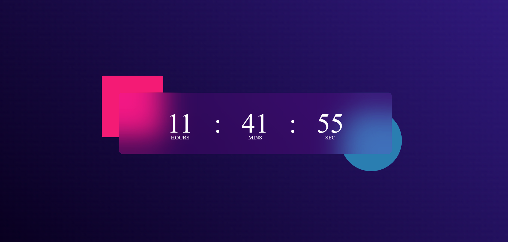

# ⏰ Responsive Digital Clock

A beautiful, modern, and fully responsive digital clock built using **HTML**, **CSS**, and **JavaScript**. This clock displays the current time (hours, minutes, seconds) in real-time with a gradient background and elegant blur effects.

---

## 📁 Project Structure

digital-clock/
│
├── index.html # Main HTML structure
├── style.css # Styling for clock and layout (responsive)
├── script.js # Logic to update time every second
└── README.md # Project documentation

---

## 🚀 Features

- ⏳ Real-time digital clock (HH:MM:SS)
- 🌈 Stylish gradient background with glassmorphism effect
- 📱 Fully responsive for mobile, tablet, and desktop
- 🖌️ Clean UI using modern CSS (Flexbox, media queries)
- 🧠 Lightweight and beginner-friendly JavaScript logic

---

## 📸 Preview



---

## 🔧 How to Run

1. **Clone or Download** the repository:
   ```bash
   git clone https://github.com/your-username/digital-clock.git


